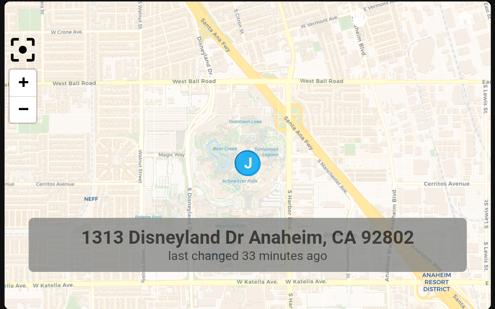

# Locate a Person

This blueprint enables you to display the location of a home assistant user on a map. The map also shows the geocoded address with most recent location update in relative time. If you choose to hold the view, it will provide real-time updates as the tracking device sends new location data.

Requires [locate]([https://github.com/dinki/View-Assist/blob/main/locate-a-person/View%20Assist%20dashboard%20and%20views/views/locate/](https://raw.githubusercontent.com/dinki/View-Assist/refs/heads/main/View%20Assist%20dashboard%20and%20views/views/locate/locate.yaml)) view

Optional requirements for the geocoded tracker sensor in the companion app:
  * The **Background location** needs to be enabled. It can be found in the home assistant mobile app -> settings -> companion app -> Location sensors.
  * The **Geolocation sensor** needs to be enabled along with it's setting to **Update sensor with location sensors**. It can be found in the home assistant mobile app -> settings -> companion app -> manage sensors.  
  * The **Background access** also needs to be enabled. It can be found in the home assistant mobile app -> settings -> companion app -> other settings.

Notes:
  * The names should be defined phonetically, as the voice assistant interprets them, followed by the person's name as listed in the People menu under settings. To assist in determining the voice assistant's spelling of the name, a visual display of the name will be shown if it is incorrect.
  *  The maps pinch-to-zoom and drag controls have been replaced with a tap to hold. The reset focus, along with the plus and minus buttons, function as expected.
