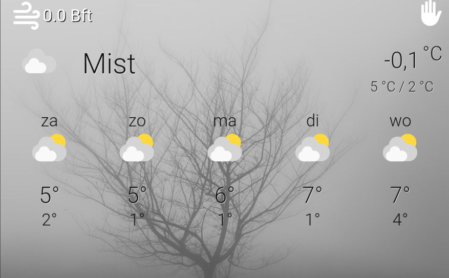

# Weather Dynamic

The Weather Dynamic view will change the background based on the weather status.

## Installation
You will need to create an additional folder in the backgrounds folder in the viewassist folder. Call this folder "weather"
In this folder you place photos or images that correspond to the status of the weather, e.g. rainy.jpg, snowy.jpg, cloudy.jpg.

[Create or update a view with the yaml](https://github.com/dinki/View-Assist/blob/main/View%20Assist%20dashboard%20and%20views/views/community_contributions/weatherdynamic.yaml)

Enter the entities weather daily and weather windspeed (this can be the same)

 In the yaml file I have included a list as an example. The status can change depending on the weather station used.
 The quantity depends on how much different your weather provider can provide.

So if you get a black background, the status does not match the name of the image. example:
"cloudy": "/local/viewassist/backgrounds/weather/cloudy.jpg", can be
"Cloudy": "/local/viewassist/backgrounds/weather/cloudy.jpg",
Rainy can be Rain ed.

Have fun with the dashboard
## Changelog

| Version | Description     |
| ------- | --------------- |
| v 1.0.0 | Initial release |
