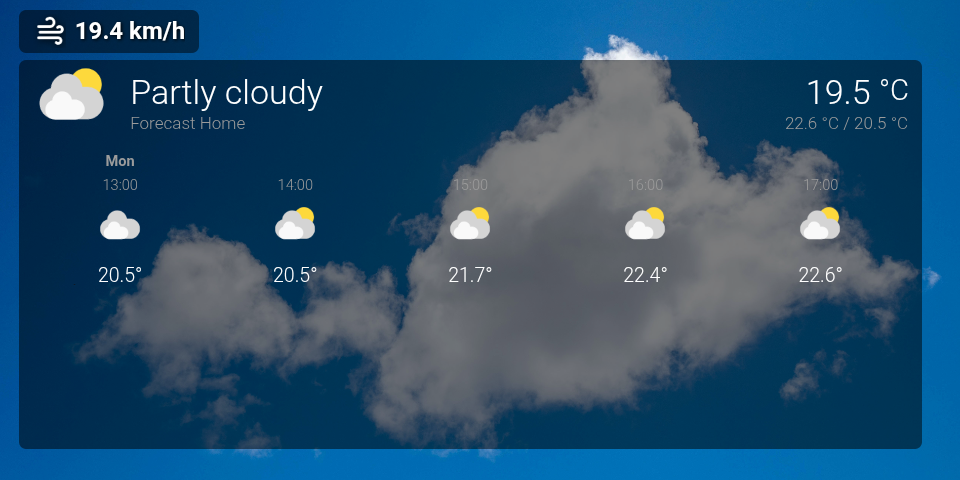
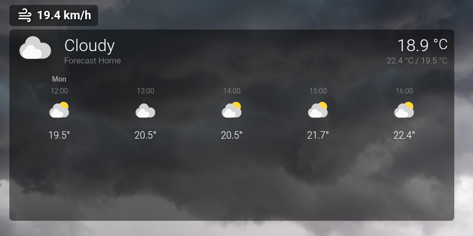

# Weather Dynamic

The Weather Dynamic view automatically changes its background image to match the current weather conditions/state.




## Installation

### 1. Create the background directories

On your Home Assistant instance, create the following directory structure:

```text
/config/www/viewassist/backgrounds/weather/
```

### 2. Add the weather background images

Either download and extract [`weather-pictures.zip`](https://github.com/dinki/View-Assist/blob/main/View%20Assist%20dashboard%20and%20views/views/community_contributions/weather-pictures.zip) into:

```text
/config/www/viewassist/backgrounds/weather/
```

Alternatively, you can use your own images. Each image must use the filename expected by the YAML configuration, for example:

```text
rainy.jpg
snowy.jpg
cloudy.jpg
```

The complete list of expected filenames can be found in the background mapping within the supplied YAML.

### 3. Create or update the Weather view

[Create or update the current Weather view with this yaml](https://github.com/dinki/View-Assist/blob/main/View%20Assist%20dashboard%20and%20views/views/community_contributions/weatherdynamic.yaml)

### 4. Configure your weather entity

In Home Assistant, go to:

```text
Developer Tools → States
```

Find the weather entity that you want to use. For example:

```text
weather.forecast_home
```

Replace every occurrence of `weather.forecast_home` in the supplied YAML with your own weather entity ID, if it differs.

The weather entity must provide forecast data. Wind speed is read directly from its `wind_speed` and `wind_speed_unit` attributes, so a separate wind-speed sensor is not required.

### 5. Check the weather states

The YAML includes background mappings for common Home Assistant weather states.

The available state names may vary depending on the weather integration or weather station being used. Check the current state of your weather entity under `Developer Tools → States` and ensure that it has a corresponding image in the YAML background mapping.

### 6. Note the Weather card version

The supplied YAML sets:
`weathercardversion: 1.1.0`

This has been set to match the current upstream Weather card version and prevents Home Assistant from creating a Repair task asking you to update the view.

Future View Assist updates may overwrite this customised Weather view with the upstream YAML. If that happens, you may need to restore the custom YAML and reapply your weather entity and background settings.

### 7. Save and test the view

Save the dashboard and open the new view on your View Assist display.

If the background is black or missing, check that:

* The current weather state has a matching entry in the YAML background mapping.
* The corresponding image exists in `/config/www/viewassist/backgrounds/weather/`.
* The filename and file extension match the YAML exactly.
* The image can be opened directly from Home Assistant using its `/local/` path.

For example:

```text
/local/viewassist/backgrounds/weather/cloudy.jpg
```

## Sample backgrounds

[Sample backgrounds can be found here](https://github.com/dinki/View-Assist/blob/main/View%20Assist%20dashboard%20and%20views/views/community_contributions/weather-pictures.zip)

## Changelog

| Version | Description                                           |
| ------- | ----------------------------------------------------- |
| v1.0.0  | Initial release                                       |
| v1.1.0  | Refactored the configuration and improved readability |
