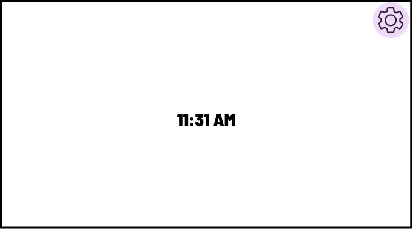
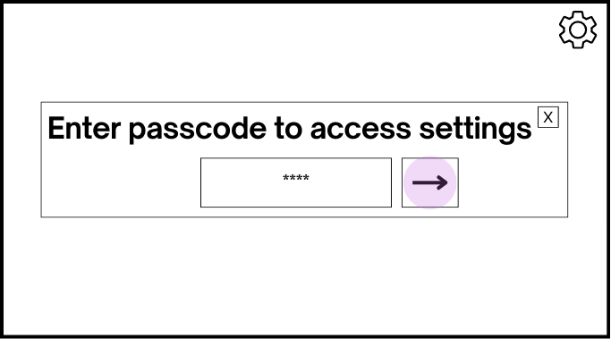
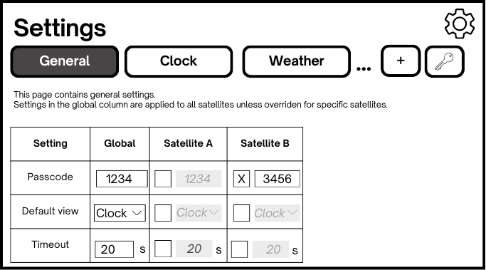
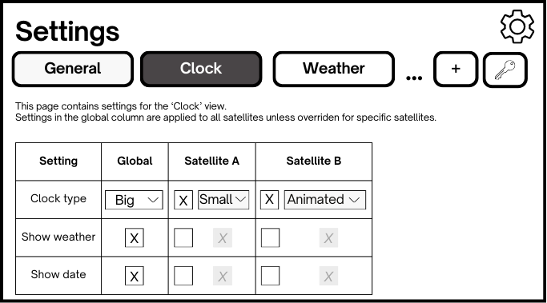
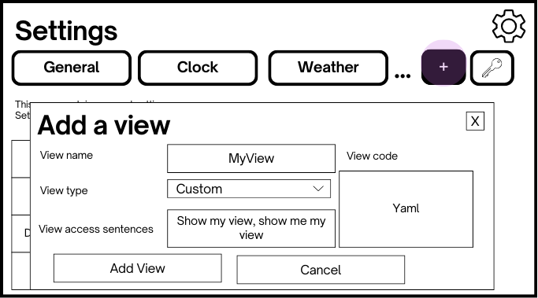
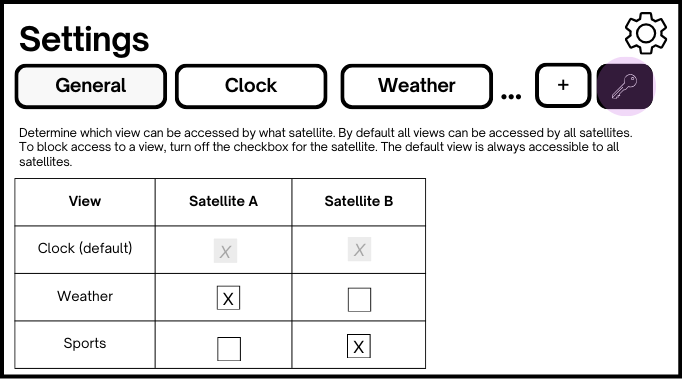

# Functional spec

**Version history**

|Date|Version|Author|Notes|
|---|---|---|--|
2025-01-19|v0.1|Jay|First version created|

## Components
VA integration consists of two components:
- one or more HA entities, representing one or more satellite devices, such as Lenovo Thinksmart tablet
- a panel
- services

## Guiding principles

1. Config should be as simple as possible and limit the amount of code editing required.
2. More advanced scenarios and tweaks might require code editing.
3. Satellites should be easy to set up and require minimal maintenace once set up.
4. Panel should be configurable for all satellites at once while also allowing for satellite-specific configurations.
5. Configuration that has to do with interacting with the satellite device itself is in the config flow. All other settings are in the panel, including how things are displayed on the satellite's screen (if present).
6. Optional settings for satellites are in options flow.
7. Settings that are set for multiple satellites should be in the panel.

## Satellite set up and configuration
Setting up a satellite requires the following steps:
1. Satellite device hardware and software configuration
2. Requirements set up
3. Integration set up

### Configuration of the Satellite device hardware and software
This is highly specific to the sattelite device used and while we can and will provide guidance / instructions for popular devices it's impossible to describe all. We will however describe the requirements for a satellite.

### Requirements set up
Before the satellite can be configured as an entity in HA, various other components need to be set up. Their set up is out of scope for the VA integration and needs to be performed before the VA satellite entity is set up. Here's a list of components required and the options available. We will provide documentation and instructions for each.
1. *Browser mod*. Needs to be installed (hopefully in the future we will have an option that doesn't require this).
2. *Microphone device*. Available options: HassMic (preferred), StreamAssist, ...
3. *Media player device*. Available options: browsermod media player, HassMic media player, ...
4. *Music player device*. Can be the same as the media player device, so same options are available. Additional options like Music Assistant are available (and most common).

## Integration setup
The VA integration can be found in the HA integration screen and will walk the user through a series of steps (config flow) to set up the integration and a satellite. The satellite is represented as a HA sensor with attributes. If the user wants to configure multiple satellites they simply start the config flow again. One set up of the first satellite the panel is created. We will have one panel, even if there are multiple satellites set up. 

### Config flow
These are the settings provided during config flow:
1. **Type**: device with display or without
2. **Name**: the unique name of the satellite
3. **Microphone device**: the entity to use as the microphone device. This devices captures the intent of the user speaking to the satellite.
4. **Media player device**: the entity to use as the mediaplayer for the satellite. TTS output will be sent to this media player device.
5. **Music player device**: the entity to use as the musicplayer for the satellite. This can be different or the same as the media player device. Will be used to play music to.
6. **Display device**: which entity to use to display satellite output on. Only available for satellites that are configured as type display. This should be set to the browser path entity of browser mod for the satellite.
7. **Browser ID**: the ID of the browser mod installation. Only available for satellites that are configured as type display. 

### Options flow
The options flow is available after finishing the config flow for a satellite and will give the user access to the following settings so they can change these without having to delete and re-create their satellite config:
1. Type
2. Microphone device
3. Media player device
4. Music player device
5. Display device
6. Browser ID
7. Specific weather entity to use (to override weather entity configured for all satellites)

These settings are in the options flow because we don't feel like the user needs to change them that often after they are set up (principle ##5).

## What the integration set up creates
Succesfully completing at least one config flow of the integration creates the following items:
- **a sensor** representing each satellite. Each satellite has its own sensor entity
- **a panel** that hosts the views. There is only one panel and all satellites share the same panel but can have specific configurations for the views in the panel (see below).
- **a group** hosting all the satellites. There is only one group of satellites.
- **a timer** helper for each satellite. there is only one timer per satellite.
- **services** that can be used to cause specific actions to happen on the satellites

## Services
The integration provides the following services:

1. **Broadcast service**. This sends a message to all satellites which is shown on the intent view.
1. **Show view service** (for all satellites or specific satellites). This switches the view on the specified satellites.
1. **Set mode service**  (for all satellites or specific satellites). This sets the mode on the specified satellites.
1. **Set do not disturb** service (for all satellites or specific satellites). This sets the specified sattelites to do not disturb or turns off do not disturb.

## Panel
This is the big one. The panel serves multiple purposes:
-  It's the dashboard satellites with a display will show. This will be configured automatically as part of the config flow for the satellite.
-  The dashboard consists of multiple views. The following views are provided:
    1. Clock
    1. Alarm / timer
    1. Intent
    1. Music
    1. Camera
    1. List
    1. Locate
    1. Sports
    1. Thermostat
    1. Weather
    1. Webpage
- a settings page accessed from any view by selecting the button in the top-right (location and icon t.b.d.). See below for details.

### Settings page in panel
The settings page is where settings are made that have to do with how information is presented on the satellites. It is accessed from any view by a simple button press and can be protected with a passcode that needs to be entered to gain access. For example, here the user is accessing the settings from the clock view:

If a passcode is set up it needs to be entered correctly before the setting page can be accessed:

The settings page contains tabs for general settings and view-specific settings. Each settings tab allows the user to make settings that are inherited by all satellites as well as to override settings per satellite. This gives the user maximum flexibility. All settings tabs use the same 'matrix' structure to visualize these settings.  By default the general settings tab is selected:

By default the "global" setting value are inherited by all sattelites, but can be overriden per satellite by selecting the 'override' checkbox in the correct cell. That enables the UI element to change the default value, as the image above shows for the passcode setting for Satellite B. In the image above, all other global settings are inherited to both Sattelite A and B.

Any setting changes made are applied immediately. The setting page can be closed using the same button as was used to open it. This button is available on all settings pages.

The following settings pages and buttons are available:
- general settings
- view-specific settings (clock, weather, etc)
- add view button
- access control settings

#### General settings
The general settings tab provides settings that are not view specific. The following settings are provided. This is not an exhaustive list and will be expanded in the future. Also, this list is not necessary going to be shown in this order:

|Setting name|Required yes/no|Type|Default value|Notes|
|---|---|---|---|---|
|**Passcode**|No|Whole Number|None|Passcode to access the settings page|
|**Default view**|Yes|View|Clock|The home screen to show on the satellite|
|**Timeout (s)**|Yes|20|Whole Number|Timeout in seconds after which the satellites switch back to its default view|
|**Default mode**|Yes|Enum (normal, night)|Normal|Available options: normal, night|
|**Show top bar**|Yes|Boolean|False|Show or hide bar at top of the screen to provide touch access to views, similar to top bar in HA dashboards that allows access to views|
|**Default do not disturb state**|Yes|Boolean|False||
|**Launch icons**|No|String|Empty string|Need to flesh this out!|
|**Status icon size**|No|Whole number|?|Need to flesh this out!|
|**Font style**|Yes|String|Roboto|Options: Roboto, neeed to provide dropdown of options|
|**24-hour clock**|Yes|Boolean|Dependent on HA config||
|**Assistant**|Yes|Assistant entity name|Default HA assistant||
|**TTS**|Yes|HA entity name in `tts` domain|If only one TTS entity select that as default|The TTS entity to use for any system generated messages|
|**Assist Prompt**|Yes|Enum(none, flashing bar, blur pop up)|Blur pop up|how the Assist prompt is visualized. Available options: none/flashing bar/blur pop up|
|**Background image**|Yes|File name string|None|The background image|
|**Rotate background**|Yes|Boolean|False|Indicates if backgrounds should be rotated. If true, further settings are required|
|**Background rotation interval**|No|Whole number and time unit enum (second/minute/hour/day)|1 hour|Rotate background every XX time (optional, only applies if rotate background is on). This replaces the current blueprint XX minutes and XX hours settings. It allows the user to enter a value and select a time unit (seconds/minutes/hours/days).|
|**Background directory**|No|String|None|The background directory from which to retrieve backgrounds (optional, only applies if 'rotate background' is on)|
|**Local backgrounds**|No|Boolean|True|Use local backgrounds (boolean, default on). If off, retrieves backgrounds from unsplash.it|
|**Maximum images**|No|Whole number (>1)|10|Maximum number of images to store, only applies is "use local backgrounds" is off. (optional, defaults to 10, should be set at least 1)|

#### View-specific settings
Each view can have a tab with view specific settings which is only required if the view actually has settings to configure. As an example, the intent view today has no settings, but the clock view can have settings.

Here are some examples of settings per view. This is not exhaustive.

##### Clock

|Setting name|Required yes/no|Type|Default value|Notes|
|---|---|---|---|---|
|Clock type|Yes|Enum (big, small, animated)|big|
|Show weather|Yes|Boolean|True|
|Show date|Yes|Boolean|True|
|Animation speed (s)|No|Whole number|30|Applies only if clock type is set to animated|

##### Weather

|Setting name|Required yes/no|Type|Default value|Notes|
|---|---|---|---|---|
|Weather entity|Yes|HA entity name in `weather` domain|If only one entity in `weather` domain then that is the default, otherwise None|Weather entity to use to show current weather and forecast with. This should be a dropdown of HA entities in the `weather` domain.|
|Show forecast|Yes|Boolean|True|

##### Adding a view
WHen a user selects the add view button in the tabstrip containing the settings pages, the add view page opens:

Here, the user can add a new view by entering a unique view name, it's view type (any of the built-in view types or custom) and the access sentences. If any of these sentences are uttered the view should open.
If the user sets the view type to custom the view code box shows in which the user can type/paste YAML code for the view.
Add and cancel buttons are provided. If the user selects 'add view' the view is added to the tabstrip and if it is a built-in view its configuration settings are shown on that page.

##### Access control settings
The access control settings page allows the user to determine which views are accessible to which satellites. By default all views are available to all satellites. By disabling the correct checkbox a view can be made inaccessible to a satellite, which means that that satellite cannot access the view even if the correct view access sentence is uttered. The default view is always accessible by all satellites.

### Panel behavior
1. By default the `default view` is shown on the satellite's display.
1. The user can activate other views by uttering access sentences. The view is shown on the satellite's device that the user is using.
1. After `timeout` second the satellite in use switches back to the `default view`.
1. Access sentences can be used while on any view, even while music is playing. If at all possible we would want to detect intents from the configured `assistant` and subscribe to handle those, so we do not need any automations.
1. Something about link icons goes here, not sure yet what they are and how they fit in.

## Development plan and priorities
|Workitem #|Workitem|Priority|Pre requisites|Exit criteria|
|---|---|---|---|---|
|1|Integration and entity registration|0|None|User can select, load VA integration and add one or more satellites.|
|2|Panel|0|#1|Once VA integration is loaded, a panel is registered. Panel shows all built-in views and exhibits behavior described in [Panel behavior](#panel-behavior).|
|3|Setting page|0|#2|Setting page can be accessed from all views in panel|
|4|Tabstrip for settings page|0|#3||Multiple tabs can be registered on the tabstrip and can be switched|
|5|Matrix for settings pages|0|#3|Multiple setting rows can be added, the global column is available and the sallites are shown as columns. Each satellite column cell has an override checkbox which is default off and the same input element as the global setting. If a override checkbox is not checked, any change to the corresponding global setting is reflected in the (disabled) input element. If a override checkbox is checked, the input element is enabled and any changes to the global setting is not reflected any more.|
|6|General settings page|0|#3,#4,#5|Settings page applies settings to satellites as configured. Settings currently in blueprint are available|
|7|Clock settings|0|#3,#4,#5|Setting page applies settings to clock view as configured|
|8|Passcode entrybox|1|#3|Passcode setting is available to on general settings page and user can enter configured passcode to access settings panel|
|9|Add view|1|#3|User can add a view and invoke the view using view access sentences. Custom views can be added by pasting YAML code|
|10|Access control|2|#3|User can enable / disable views from access by satellites and those changes are reflected|

Not in the table above:
- other view settings, similar to #7

## Open questions
Lots of open questions, but here are a few:
1. Should we provide a way to customize access sentences for built-in views? Should this be a setting on the [view specific settings page](#view-specific-settings?
1. Is it indeed possible to listen to intent from `assistant` and have the integration act on it? This is a research item which we might have to discuss with HA devs.
1. ...