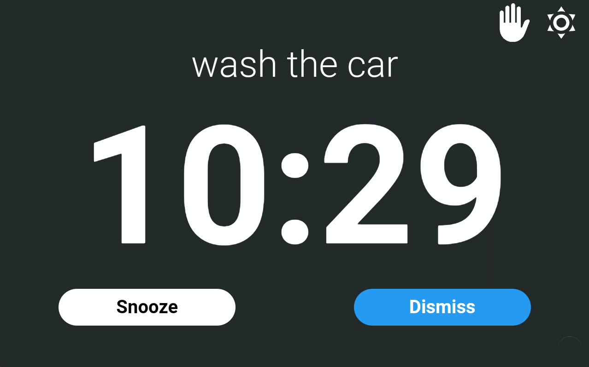

# Alarm View

* **Description**: A card that allows for interacting with alarms, reminders and timers
* **Defaultname**: alarm
* **Current Version**: v1.0.1
* **Code link**:  [ View Raw Code](https://raw.githubusercontent.com/dinki/View-Assist/refs/heads/main/View%20Assist%20dashboard%20and%20views/views/alarm/alarm.yaml)
* **Special Requirements**: None

## Installation 

This card can be added by copy pasting the raw code into a new view. 
## Changelog

| Version | Description |
| ------- | ----------- |
| v 1.0.1 | Remove hardcoded background |
| v 1.0.0 | Initial release |

