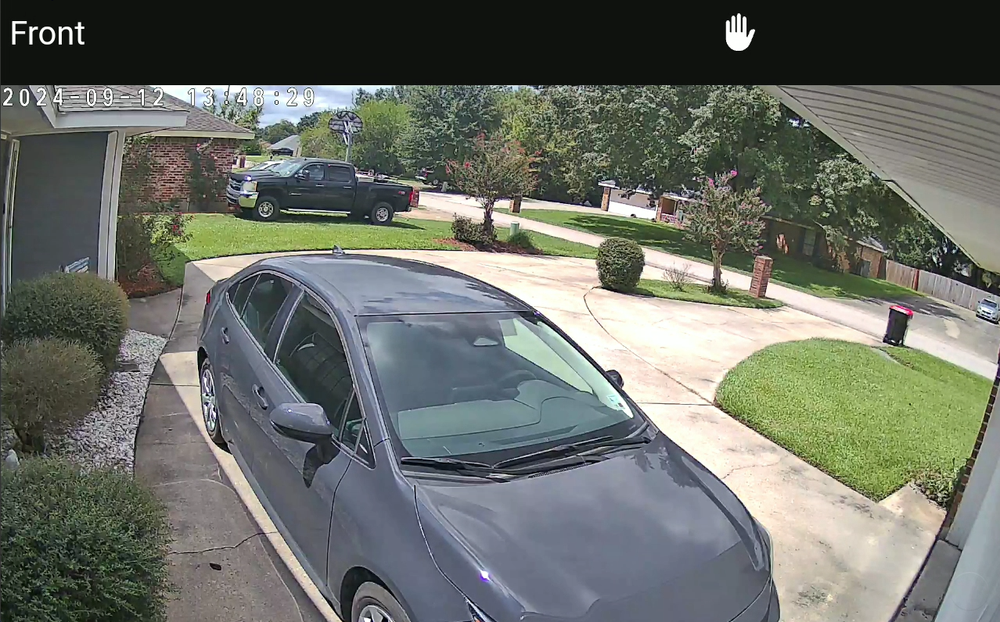

# Camera View

* **Description**: A dynamic card that allows for full screen viewing of security cameras
* **Defaultname**: camera
* **Current Version**: v1.0.0
* **Code link**:  [ View Raw Code](https://raw.githubusercontent.com/dinki/View-Assist/main/View%20Assist%20dashboard%20and%20views/views/camera/camera.yaml)
* **Special Requirements**: Requires frigate-hass-card

## Installation 

This card can be added by copy pasting the raw code into a new view.  The [frigate-hass-card](https://github.com/dermotduffy/frigate-hass-card) must be installed to use this view.  This can be installed via HACS.
## Changelog

| Version | Description |
| ------- | ----------- |
| v 1.0.0 | Initial release |

