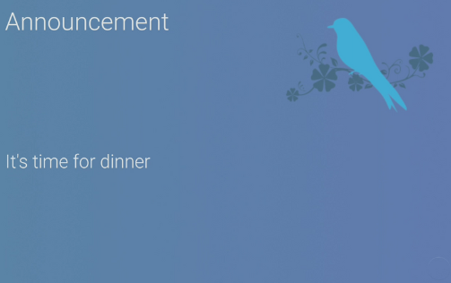

# Info and Infopic Views

These cards are very similar in their requirements and installation that they have been presented with the same instructions short of the raw code.  You will more than likely want both installed.  Some day these may be combined into one.

## Info view



* **Description**: Provides a view for presenting text data
* **Default name**:  info
* **Current Version**: v1.0.0
* **Code link**:  [Info View Raw Code](https://raw.githubusercontent.com/dinki/View-Assist/main/View%20Assist%20dashboard%20and%20views/views/info/info.yaml)
* **Special Requirements**: A background image will need to be upload to the HA server and the view code modified to use it

## Infopic view


* **Description**: Provides a view for presenting data with an image and text
* **Default name**:  infoview
* **Current Version**: v1.0.0
* **Code link**:  [Infopic View Raw Code](https://raw.githubusercontent.com/dinki/View-Assist/main/View%20Assist%20dashboard%20and%20views/views/infopic/infopic.yaml)


# Prerequisites

These cards require a background image.  You can choose any that you like.  The announcebird.png file has been created for your use and can be [downloaded here](https://github.com/dinki/View-Assist/blob/main/View%20Assist%20dashboard%20and%20views/views/info/announcebird.png)


# Installation 

[](https://www.youtube.com/watch?v=i4Uya9xvG1M)

Detailed install video:  https://youtu.be/i4Uya9xvG1M

---
One variable in the configuration will need to be made for the background image to be visible:

```
variables:
  background: /local/viewassist/announcebird.png
```
The background image will need to be uploaded to the web directory located within the config directory of the Home Assistant server.  That path is then added to the configuration file.

You can, of course, use any image you like.  I created this one using a public domain image that you can find [here](https://www.rawpixel.com/image/6293393/vector-background-flower-public-domain)

# Changelog

| Version | Description |
| ------- | ----------- |
| v 1.0.0 | Initial release |


