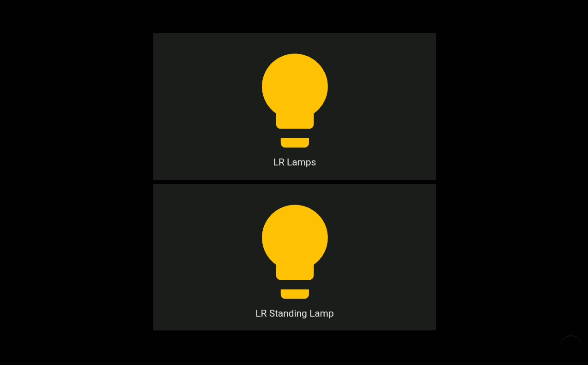

# Intent View



* **Description**: Provides a view showing devices turned on/off, open/closed and others when issuing voice commands
* **Defaultname**:  intent
* **Current Version**: v1.0.0
* **Code link**:  [Intent View Raw Code](https://raw.githubusercontent.com/dinki/View-Assist/main/View%20Assist%20dashboard%20and%20views/views/intent/intent.yaml)
* **Special Requirements**: Requires Custom layout card

## Installation 

This card can be added by copy pasting the raw code into a new view.  The [Custom layout card](https://github.com/thomasloven/lovelace-layout-card) must be installed to use this view. This can be installed via HACS.

## Special Considerations

Note that if viewing on a Lennova Thinksmart View you will want to set 
```
Settings > System > Advanced > Developer Options > Smallest Width
```
 to 600  for best viewing experience.  You will also need to close and restart your browser for this change to take effect.

## Changelog

| Version | Description |
| ------- | ----------- |
| v 1.0.0 | Initial release |


