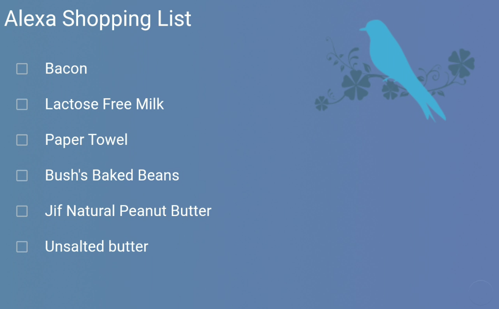

# List View



* **Description**: Provides a view for presenting Home Assistant todo list entities.  Two versions provided.  One has the checkbox option and the other does not show checkboxes
* **Default name**:  list
* **Current Version**: v1.0.1
* **Code link**:  [List View Raw Code](https://raw.githubusercontent.com/dinki/View-Assist/main/View%20Assist%20dashboard%20and%20views/views/list/list.yaml)  |  [List View No Checkbox](https://raw.githubusercontent.com/dinki/View-Assist/main/View%20Assist%20dashboard%20and%20views/views/list/list-nocheckbox.yaml)
* **Special Requirements**: A background image will need to be upload to the HA server and the view code modified to use it

## Installation 

Copy paste the default or the no checkbox version code to a new view and update the background image to one of your choosing

---
One variable in the configuration will need to be made for the background image to be visible:

```
variables:
  background: /local/viewassist/announcebird.png
```
The background image will need to be uploaded to the web directory located within the config directory of the Home Assistant server.  That path is then added to the configuration file.

You can, of course, use any image you like.  I created this one using a public domain image that you can find [here](https://www.rawpixel.com/image/6293393/vector-background-flower-public-domain)

## Changelog

| Version | Description |
| ------- | ----------- |
| v 1.0.1 | Move list variable out of dictionary |
| v 1.0.0 | Initial release |


