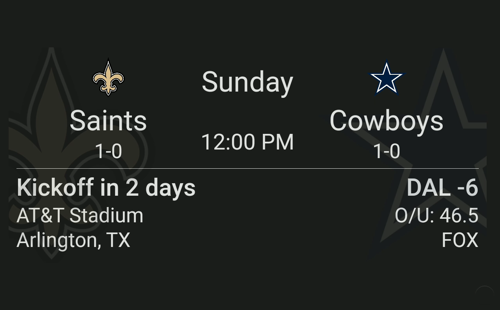

# Sports View

* **Description**: Shows matchup results, in game or upcoming information for various sports events
* **Defaultname**:  sports
* **Current Version**: v1.0.0
* **Code link**:  [Webpage View Raw Code](https://raw.githubusercontent.com/dinki/View-Assist/main/View%20Assist%20dashboard%20and%20views/views/sports/sports.yaml)
* **Special Requirements**: Requires ha-teamtracker-card

## Installation 

This card can be added by copy pasting the raw code into a new view.   The [ha-teamtracker-card](https://github.com/vasqued2/ha-teamtracker-card) must be installed to use this view. This can be installed via HACS.

## Changelog

| Version | Description |
| ------- | ----------- |
| v 1.0.0 | Initial release |

