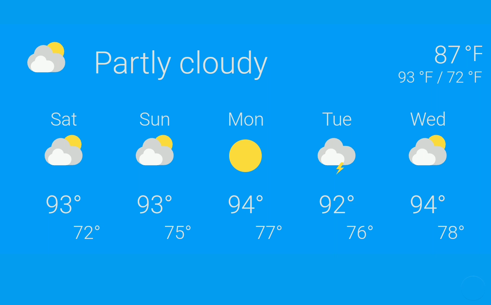

# Weather View



* **Description**: Provides a view for presenting weather forecast and current conditions
* **Default name**:  weather
* **Current Version**: v1.0.2
* **Code link**:  [Weather View Raw Code](https://raw.githubusercontent.com/dinki/View-Assist/main/View%20Assist%20dashboard%20and%20views/views/weather/weather.yaml)
* **Special Requirements**: User must have a forecast entity and set it in the variables section

## Installation 

[](https://www.youtube.com/watch?v=H_hiLqBjQMk)

Detailed install video:
https://youtu.be/H_hiLqBjQMk

```
variables:
  var_forecast_entity: weather.home
  var_forecast_type: daily
```

This card can be added by copy pasting.  One variable in the configuration will need to be changed to reflect your weather entity.  You also have the option to change the forecast_type by setting it as either 'daily', 'hourly', or 'twice_daily'


## Changelog

| Version | Description |
| ------- | ----------- |
| v 1.0.1 | Add option to set forecast_type as daily is not available for all weather providers (credit elwing) |
| v 1.0.1 | Fix possible bad title |
| v 1.0.0 | Initial release |


