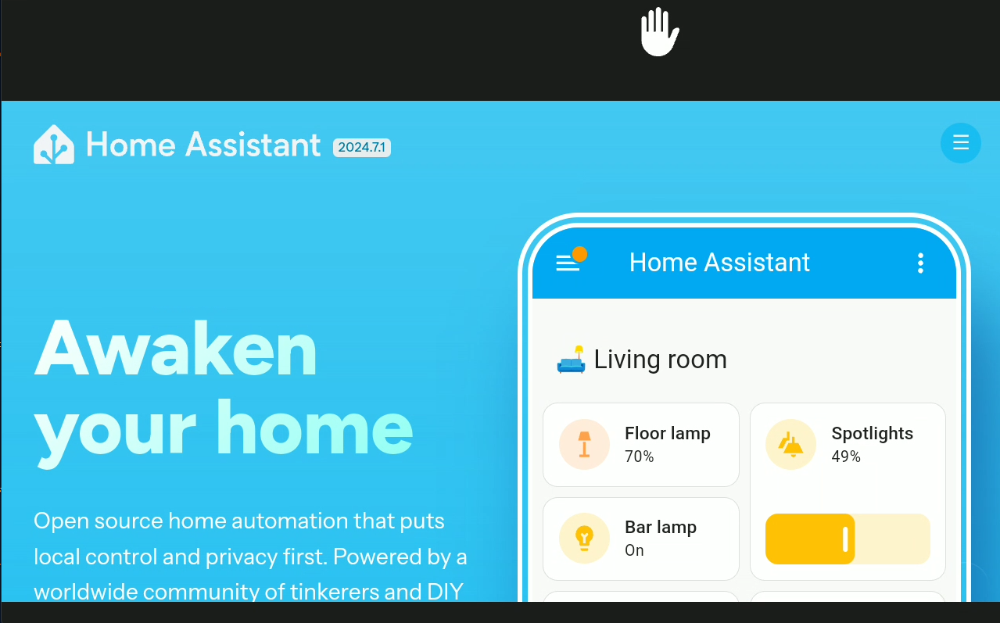

# Webpage View

* **Description**: Provides a view for presenting web based content
* **Defaultname**:  webpage
* **Current Version**: v1.0.0
* **Code link**:  [Webpage View Raw Code](https://raw.githubusercontent.com/dinki/View-Assist/main/View%20Assist%20dashboard%20and%20views/views/webpage/webpage.yaml)
* **Special Requirements**: None

## Installation 

This card can be added by copy pasting the raw code into a new view.

## Changelog

| Version | Description |
| ------- | ----------- |
| v 1.0.0 | Initial release |

