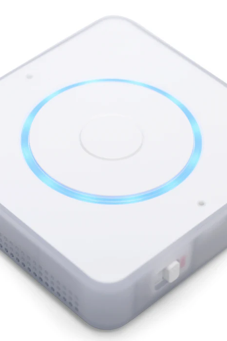

The Home Assistant Voice Preview Edition ([Ameridroid](https://ameridroid.com/products/home-assistant-voice-preview-edition?_pos=2&_sid=1dc3c1367&_ss=r) is the first hardware device released for use with Home Assistant Assist voice assistant.  We are super excited to see this quality product released and supported by Home Assistant themselves!  We are even more excited to announce that these devices work well with other View Assist satellites and are fully compatible.

Home Assistant Voice Preview Edition is the open source, privacy-focused voice assistant built to seamlessly connect with Home Assistant, and preview the future of voice today. Its advanced audio processor and dual microphones allow it to hear your commands and control devices. Tactile controls, the injection-molded case and LED ring lend to its premium feel, allowing it to blend into the home. 


Configuration is as per normal for any View Assist ESPHome based voice satellites.  An example configuration:

```
- sensor:
  - name: ViewAssist_HomeAssistant_VPE
    state: ""
    unique_id : "viewassist_HomeAssistant_VPE"
    icon: "mdi:glasses"    
    attributes:
      type: audio_only
      mode: "normal"
      mic_device: "assist_satellite.assistsat_HomeAssistant_VPE_assist_satellite"
      mediaplayer_device: "media_player.assistsat_HomeAssistant_VPE_media_player"
      musicplayer_device: "media_player.assistsat_HomeAssistant_VPE_media_player_2"
```