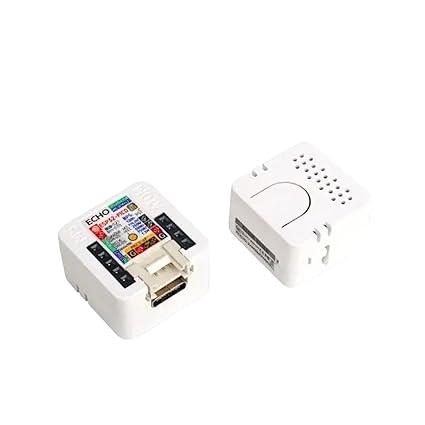

The M5Stack Atom Echo Smart Speaker ([Amazon](https://amzn.to/4eC8Tto)/[M5Stack Shop](https://shop.m5stack.com/collections/m5-controllers/products/atom-echo-smart-speaker-dev-kit)/[AliExpress](https://www.aliexpress.us/item/3256803113017446.html?aff_platform=portals-tool&sk=_A8G2YF&aff_trace_key=90326d2a90444b4887632f62dd533ce4-1654058373639-07963-_A8G2YF&terminal_id=c5517a8c9bb44b4fb32147398fbc2576&aff_fcid=90326d2a90444b4887632f62dd533ce4-1654058373639-07963-_A8G2YF&tt=CPS_NORMAL&aff_fsk=_A8G2YF&gatewayAdapt=glo2usa4itemAdapt)) is a small device that allows for easy set up via a webbased flashing tool.  This is one of the easiest devices to get started with Home Assistant voice.  Do know, however, that it is far from perfect in regards to its audio output.  The speaker is very small and does not sound great but it is an inexpensive device and does get the job done for light work.

See our [detailed set up page](../../viewassist-setup/satellite-configuration/esphome/m5stack-atom-echo.md) for installation.
