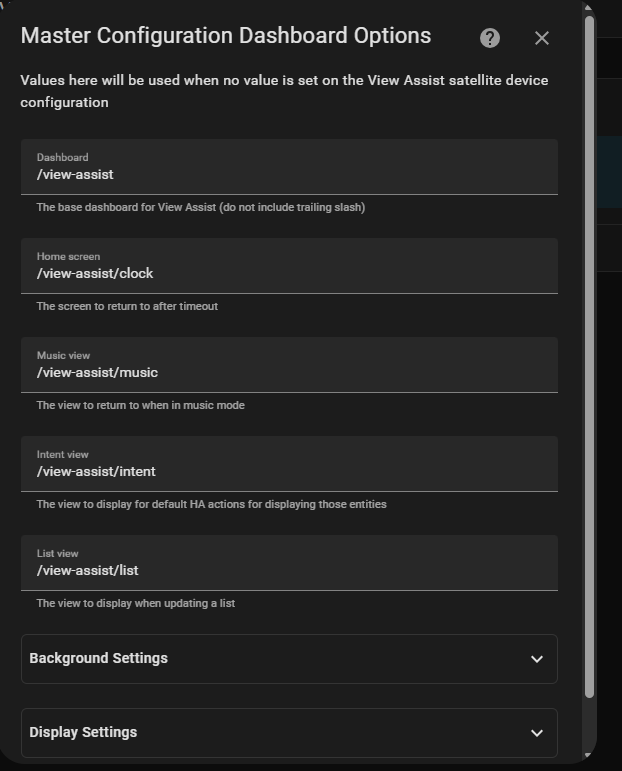
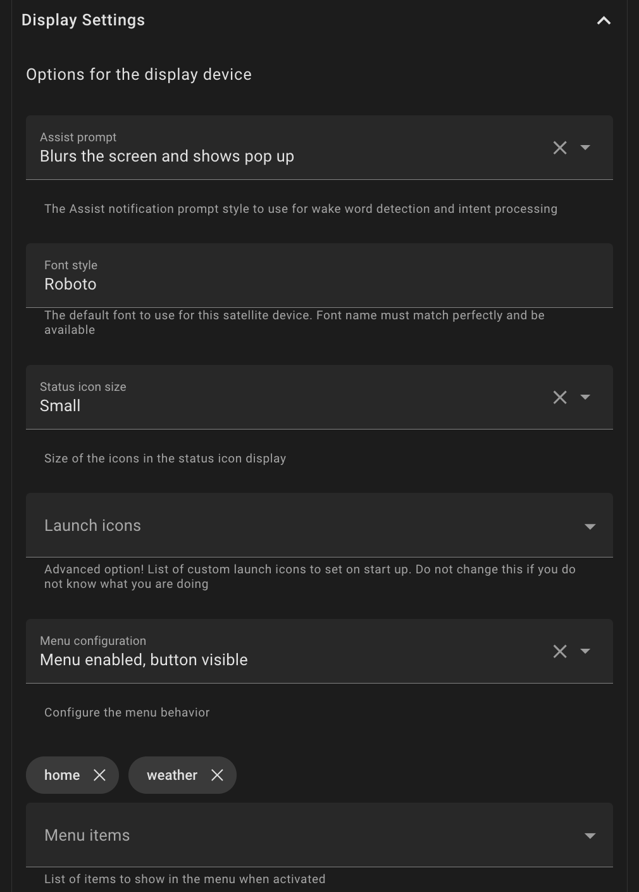
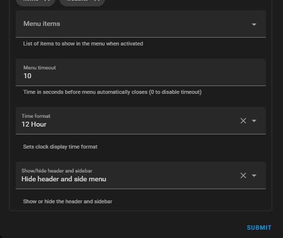

# Dashboard Options (Display enabled satellites only)

## General Settings

The dashboard options control different aspects of the View Assist display

- **Dashboard** - The base dashboard for View Assist (default /viewassist/)
- **Home screen** - The screen to return to after timeout (default /viewassist/clock)
- **Default Music View screen** - The view to return to when in music mode (default /viewassist/music)
- **Intent View Screen** - The view to display for default HA actions for displaying those entities (default /viewassist/intent)
- **List View** - The view for displaying Home Assistant list type data like shopping and to do lists (default /viewassist/list)

## Background Settings

- **Background Image Source** - This option is used to determine how the background image is handled. The options are:
  - **Default background** - Use a defined background image (see below)
  - **Local file path sequence** - Picks images in their sorted order from the image path defined below
  - **Local file path random** - Picks images randomly from the image path defined below
  - **Download random image from Unsplash** - Downloads a random image from Unsplash website then displays it
- **Default Background** - An image path to use as default background for all satellites (default /view_assist/dashboard/background.jpg)
- **Image path** - The file path that stores the predefined and downloaded images
- **Rotation interval** - Time in minutes between image rotations

## Display Settings

- **Assist Prompt** - The Assist prompt style to use for wake word and intent processing (default blur pop up)
- **Status Icon Size** - The size of the activated status icons shown in the top right corner
- **Font Style** - The default font to use for this satellite device. Font name must match perfectly and be available (default Roboto)
- **Launch Icons** - Advanced option! List of custom launch icons to set on start up. Additional documentation to follow
  - **Launch Icons Menu Configuration** - Advanced option! Allows for adding a single menu icon that when tapped will expand to additional icons. Add the icons to show in this configuration option. Additional documentation to follow
  - **Launch Icons Menu Timeout** - Time in seconds before menu automatically closes (0 to disable timeout)
- **Use 24 Hour Time** - Sets clock display to 24 hour time when enabled
- **Show/Hide Header and Side bars** - Show or hide the header and sidebar
