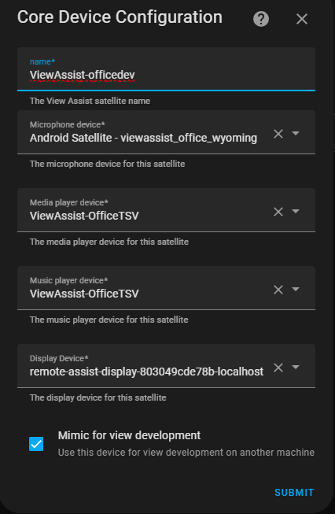

# Core Device Configuration

These options should look very familiar as they are the same values you entered when creating the device.  If you make changes in the future you can come here to reconfigure.  Hit the 'Submit' button to save the changes
