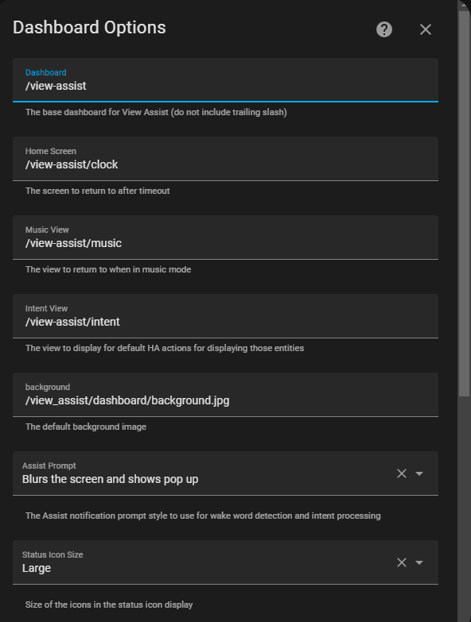
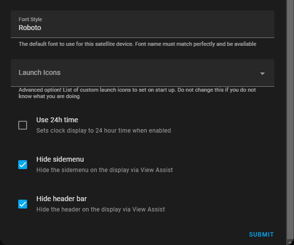

# Dashboard Options (Display enabled satellites only)

The dashboard options control different aspects of the View Assist display

* Dashboard - The base dashboard for View Assist (default /dashboard-viewassist/)
* Home screen - The screen to return to after timeout (default /dashboard-viewassist/clock)
* Default Music View screen - The view to return to when in music mode (default /dashboard-viewassist/music)
* Intent View Screen - The view to display for default HA actions for displaying those entities (default /dashboard-viewassist/intent)
* Default Background -  The default background image
* Enable image rotation - This option when enabled will change background images at a given interval (default off)
  * Image Source - This option is used with the image rotation option above.  The options are:
    * Local file path sequence - Picks images in their sorted order from the image path defined below
    * Local file path random - Picks images randomly from the image path defined below    
    * Download random image from Unsplash - Downloads a random image from Unsplash website then displays it
  * Image path - The file path that stores the predefined and downloaded images
  * Rotation interval - Time in minutes between image rotations
* Assist Prompt - The Assist prompt style to use for wake word and intent processing (default blur pop up)
* Status Icon Size - The size of the activated status icons shown in the top right corner
* Font Style - The default font to use for this satellite device. Font name must match perfectly and be available (default Roboto)
* Launch Icons - Advanced option! List of custom launch icons to set on start up. See this sections for setting these up
* Use 24 Hour Time - Sets clock display to 24 hour time when enabled 
* Hide sidemenu - Hides the left menu
* Hide header bar - Hides the top menu