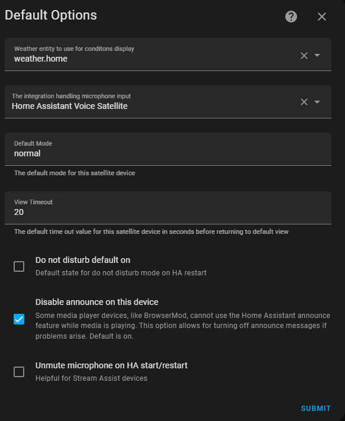

# Default Options (Display enabled satellites only)

The default options contain a variety of different configuration settings

* Weather Entity - The weather entity to display on this View Assist satellite(example weather.home)
* Microphone Input Integration - The microphone provider type (example HassMic)
* Default Mode - The default mode for this satellite device (default normal)
* View Timeout - The default time out value for this satellite device in seconds before returning to the home view (default 20)
* Do Not Disturb - Default state for do not disturb mode (default off)
* Use Announce - Some media player devices like BrowserMod and Squeezelite cannot use the Home Assistant announce feature while media is playing. This option allows for turning off announce messages if problems arise. Default is on but turn this off if your device supports announce
* Unmute Mic - Unmute microphone on HA start/restart. This is helpful for Stream Assist devices which default to muted on Home Asistant start