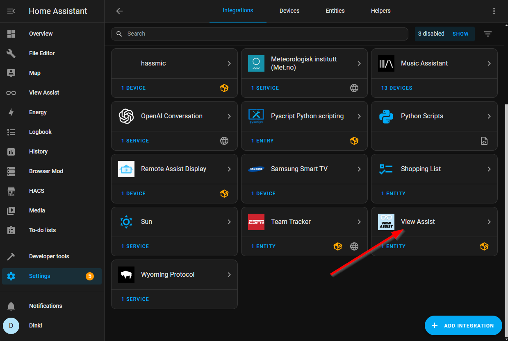
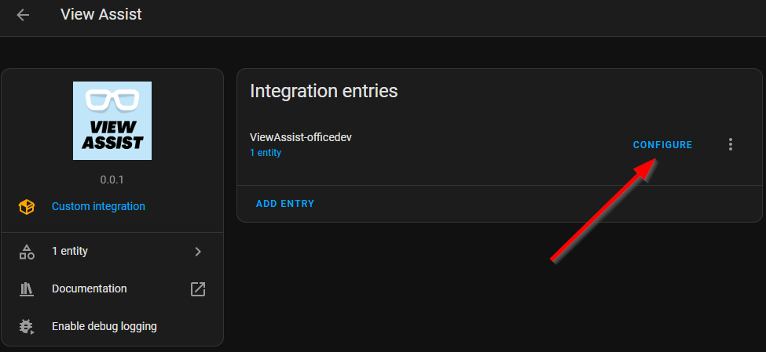
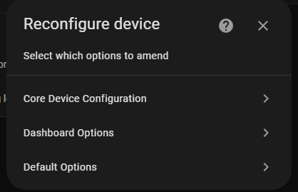

# Satellite Device Configuration

Once the View Assist satellite device is created you can then customize some aspects.  This section will detail what is available.

In Home Assistant go to Settings -> Devices and Services and click on View Assist

From this page, click on the device you want to configure

We will now detail each of the three options.