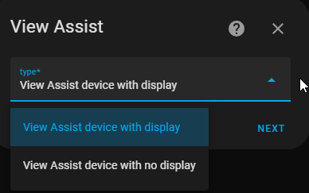
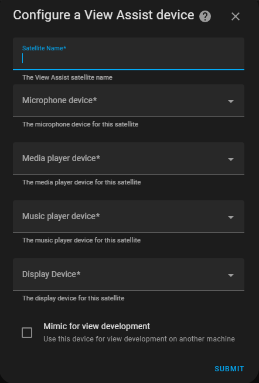
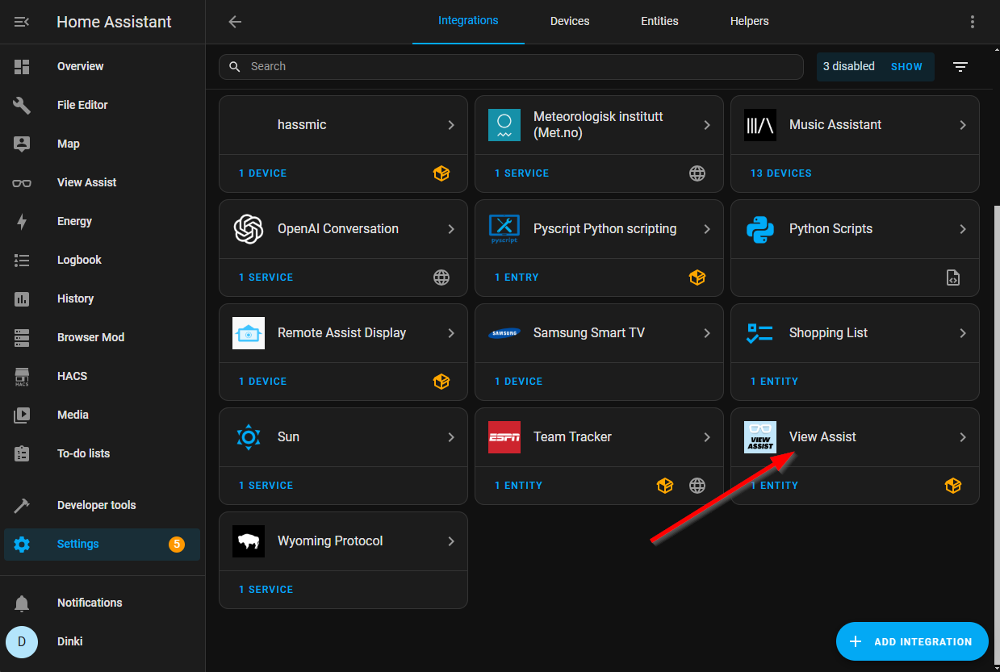
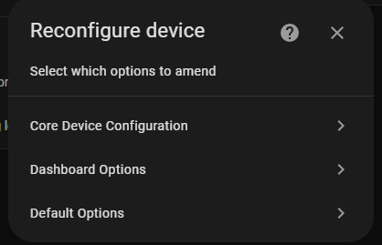

# Satellite Device Creation

Despite the name, View Assist supports both devices with and without displays. These devices can use the same custom sentences and can interact with each other. These are the instructions for adding these devices:

In Home Assistant go to Settings -> Devices and Services -> Add integration -> Search for View Assist and click 'Add'

Choose the type of satellite device you are wanting to create and click 'Next'

Here we are configuring a device with display. Note that the audio only devices will not have the 'Display Device' or the 'Mimic for view development' options but everything else is the same. We will need to fill out these core configuration options before the device can be used. Here's the explanation of the fields:

    - **Satellite Name:** The satellite device name (eg ViewAssist-livingroom)
    - **Microphone Device:**  Used to assign microphone to View Assist device.  See the microphone section for set up instructions
    - **Media Player Device:** Used to assign the media player used for View Assist audio message playback
    - **Music Player Device:** Used to assign the media player used for View Assist music playback.  This can be the same as Media Player Device or different
    - **Intent Device:** The device to provide intent data for this satellite.  This is optional but can be used to provide AI context for display and should be configured if possible.  View Assist Companion App users should search for the 'intent' device for that matches this device.
    - **Display Device:** Used to assign display device to View Assist device.  See the display section for set up instructions

After setting these values you can then click 'Submit' and the View Assist satellite will be ready for use!

# Satellite Device Default Option Override

Once the View Assist satellite device is created you can then customize the default options set in the Master Configuration for this satellite device if you desire:

In Home Assistant go to Settings -> Devices and Services and click on View Assist

From this page, click on the device you want to configure

Enter the section and make any needed changes and hit submit. This will set those options for use on this satellite device only
