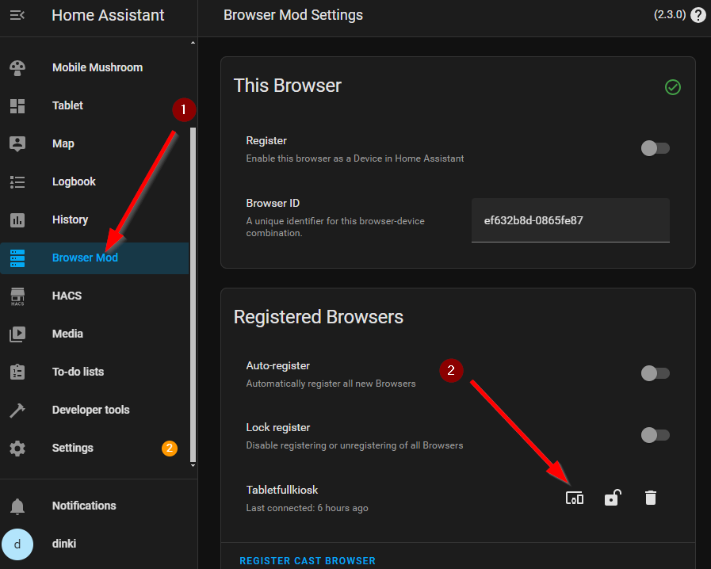
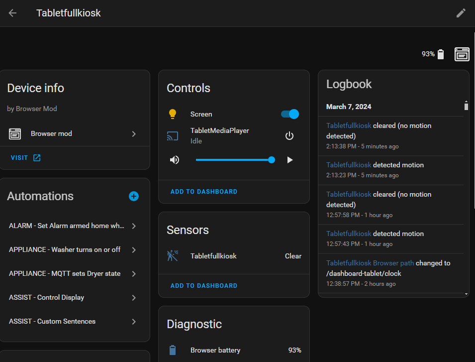

# Browser Mod {#browsermod}
Browser Mod 2 custom integration was previously heavily used by View Assist but now has been relegated to one particular function.  Browser Mod is now used for device identification only.  We hope to eventually make this an internal feature but until then it will need to be configured for this purpose.  

## Installation

Detailed install video:
https://www.youtube.com/watch?v=7UOfP5JjxFY

Note that the video was recorded when View Assist relied more on this integration than it does now.  You can ignore everything from the 4:55 mark on

Please follow the steps for installation here:
https://github.com/thomasloven/hass-browser_mod#installation-instructions

:::danger[Restart Required]
Please remember you must restart Home Assistant after installing Browser Mod
:::

### Validate Installation
Before continuing, ensure that your tablet satellite is recognized:
1. Visit your Home Assistant URL via your Browser applications of choice (Wallpanel or Fully Kiosk) 
1. Find and tap on Browser Mod in the sidebar.
1. Next, click on the icon (2) next to your registered device

You should see device information similar to the screenshot below. 

---------
