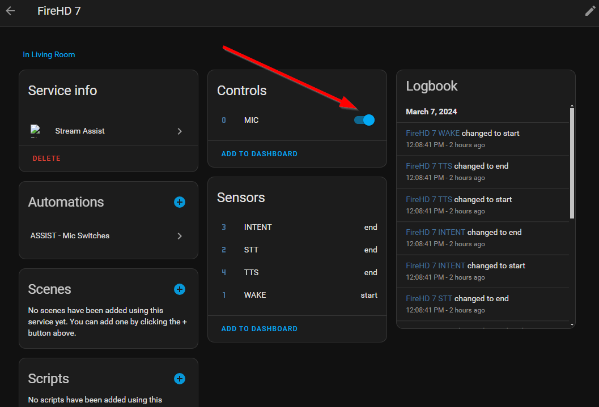

:::info
Note that these steps are only necessary if using View Assist with video enabled satellites.  It is not necessary to install these for voice only satellites.
:::

**Repo:** https://github.com/AlexxIT/StreamAssist

## Installation
1. Open HACS (typically in side navigation in your Home Assistant instance)  
1. Go to Integrations 
1. Click the 3 dots (upper top corner)
1. Choose Custom repositories 
1. Copy paste ```AlexxIT/StreamAssist```
1. Go to Category: Integration 
1. Click Add 
1. Choose Stream Assist
1. Click Install

:::danger[Restart Required]
You **must** restart Home Assistant to complete the installation.
:::

## Configuration
1. Once Home Assistant has restarted, Go to **Settings**
1. Choose **Devices and Services**
1. Click **+ Add Integration** button at bottom right
1. Search for *Stream Assist*
1. Give the device a name (eg streamassist-livingroom)
1. Enter the Stream URL for the microphone software you are using being sure to replace the example IP address with your IP tablet device's IP address
    - Example format for RTPMic ```rtp://192.168.0.152:55555```
    - Example format for IPWebcam video and audio ```rtsp://192.168.0.152:8080/h264_ulaw.sdp```
    - Example format for IPWebcam audio only ```http://192.168.0.152:8080/audio.wav```
1. The media player device should be set to the device you'd like the audio to play from.  We recommend using the media player provided by Browser Mod. 
    :::note
    You can use any media player you wish and some users leverage the media player provided by Fully Kiosk or other integrations depending on their specific use case.
    :::

1. You can choose a sound effect to alert when Assist is expecting a command.  You can find many free sound effects at Pixabay.  Here is one you may like.  Pixabay has tons of free sounds.  The one I chose for testing is: https://pixabay.com/sound-effects/system-notification-199277/.

    After uploading to your Home Assistant local media, you can specify using media-source syntax as follows:

    Enter this value to add it to your configuration:
    
    ```media-source://media_source/local/system-notification-199277.mp3```

    Docker users may need to modify their paths like this:

    ```media-source://media_source/media/system-notification-199277.mp3```

--------

### Additional Notes
For help finding your tablet's IP address, see this guide:  https://github.com/dinki/View-Assist/wiki/Find-IP-of-Android-device

Additional installation and configuration can be found here:
https://github.com/AlexxIT/StreamAssist?tab=readme-ov-file#installation

#### Microphone State
Upon restart, the Microphone for Stream Assist is often in the off state. Before attempting to use, you'll need to make sure it is on for it to recognize voice prompts. As part of the control automation discussed later, we'll make sure this mic is always on.

