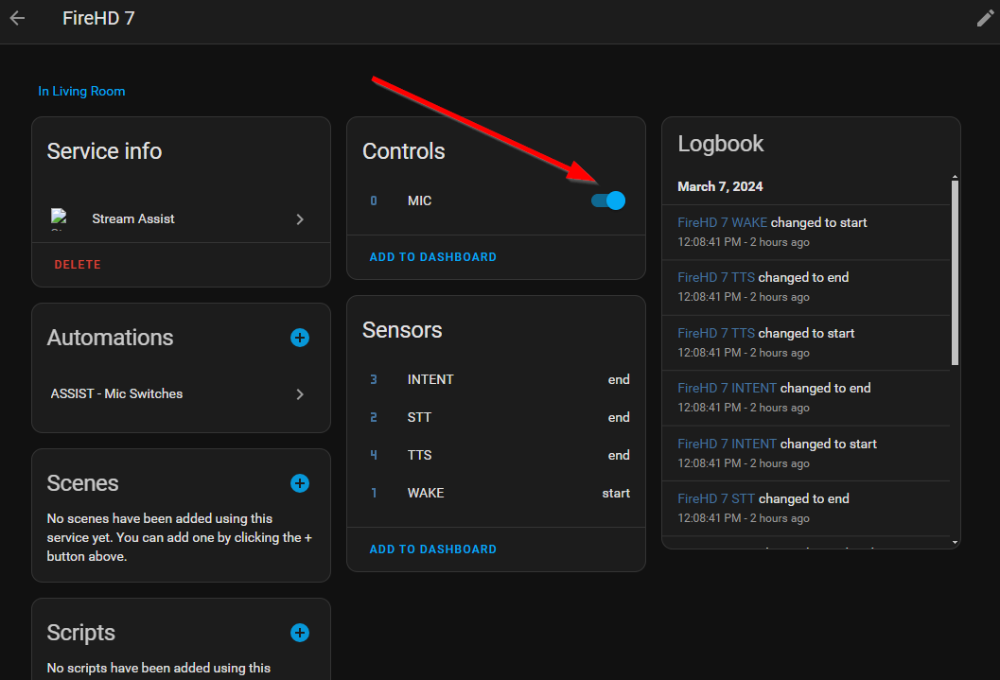

# Stream Assist Device Setup

We'll leverage Stream Assist running on your Home Assistant instance to access those streams and pass the audio into the voice pipeline. We'll cover setting up Stream Assist in a future section.

The following Android applications have been tested and found to be working. The current recommendation is to use IP Webcam, however the choice is ultimately yours. You only need to install and configure ONE of the following applications.

- [IP Webcam (Recommended)](#ip-webcam)
- [RtpMic](#rtpmic)

---

## IP Webcam {#ip-webcam}

[](https://www.youtube.com/watch?v=-7cHfqZMa1c)

Detailed install video: https://youtu.be/-7cHfqZMa1c

### Installation
1. Download and install the app from the [Google Play Store](https://play.google.com/store/apps/details?id=com.pas.webcam).  

### Configuration
1. Find the IPWebcam Icon and tap it to launch.
1. Scroll down until you see the **Service Control** heading and tap on **Optional Permissions**.
1. Tap **Allow streaming in background** and then turn on **Allow display over other apps**.
1. Tap back and then deactivate the checkbox on **Show camera overlay**. 
1. Tap back and scroll up until you see **Power management** tap it and under *Misc* Turn on **Disable notification** and **Stream on device boot**. 
1. Tap back to get back to the main setting screen.
1. Scroll down until you see the *Misc* section and tap on **Audio mode**. Choose **Audio Only**.

    :::info 
    While you can stream both audio and video via IPWebcam, we recommend using the **Audio Only** mode to reduce bandwidth and minimize video being streamed to your HA instance. Many users also prefer this due to the location of these tablet devices on the interior of their home such as in bedrooms.
    :::

1. Tap back and then scroll down and tap on **Start server**.  
1. When prompted, Allow all permissions as requested by Android OS (camera, microphone, etc.)

---

## RtpMic {#rtpmic}
:::note
RtpMic can only be installed via the Google Play store on devices running older versions of Android OS. Users have been successful manually sideloading the application on newer versions but that is beyond this tutorial.

As of Dec 2024 RtpMic is not available via Google Play Store any more
:::

[](https://www.youtube.com/watch?v=SkyErx7TE30)

Detailed install video:  https://youtu.be/SkyErx7TE30

### Installation
1. Download and install the app from the [Google Play Store](https://play.google.com/store/apps/details?id=com.rtpmic&hl=en_US&gl=US)

### Configuration

1. Find the icon on your table and launch RtpMic.
1. Scroll down and start server.  Allow all permissions.
1. Enter the settings page and set:
    - You may want to increase gain if your mic detect is low on the meter.  I have set mine to 9 dB for the ThinkSmart device I am using
    - audio codec to G.711a
    - target addr to 255.255.255.255
    - target port to 55555
    - Auto start streaming 
    - Start at boot
1. Allow any permissions Android system may request


# Stream Assist Integration Installation and Configuration

Now that software has been installed on the device for streaming we can now install the actual Stream Assist integration.


**Repo:** https://github.com/AlexxIT/StreamAssist

## Installation
1. Open HACS (typically in side navigation in your Home Assistant instance)  
1. Go to Integrations 
1. Click the 3 dots (upper top corner)
1. Choose Custom repositories 
1. Copy paste ```AlexxIT/StreamAssist```
1. Go to Category: Integration 
1. Click Add 
1. Choose Stream Assist
1. Click Install

:::danger[Restart Required]
You **must** restart Home Assistant to complete the installation.
:::

## Configuration
1. Once Home Assistant has restarted, Go to **Settings**
1. Choose **Devices and Services**
1. Click **+ Add Integration** button at bottom right
1. Search for *Stream Assist*
1. Give the device a name (eg streamassist-livingroom)
1. Enter the Stream URL for the microphone software you are using being sure to replace the example IP address with your IP tablet device's IP address
    - Example format for RTPMic ```rtp://192.168.0.152:55555```
    - Example format for IPWebcam video and audio ```rtsp://192.168.0.152:8080/h264_ulaw.sdp```
    - Example format for IPWebcam audio only ```http://192.168.0.152:8080/audio.wav```
1. The media player device should be set to the device you'd like the audio to play from.  We recommend using the media player provided by Browser Mod. 
    :::note
    You can use any media player you wish and some users leverage the media player provided by Fully Kiosk or other integrations depending on their specific use case.
    :::

1. You can choose a sound effect to alert when Assist is expecting a command.  You can find many free sound effects at Pixabay.  Here is one you may like.  Pixabay has tons of free sounds.  The one I chose for testing is: https://pixabay.com/sound-effects/system-notification-199277/.

    After uploading to your Home Assistant local media, you can specify using media-source syntax as follows:

    Enter this value to add it to your configuration:
    
    ```media-source://media_source/local/system-notification-199277.mp3```

    Docker users may need to modify their paths like this:

    ```media-source://media_source/media/system-notification-199277.mp3```

--------

### Additional Notes
For help finding your tablet's IP address, see this guide:  https://github.com/dinki/View-Assist/wiki/Find-IP-of-Android-device

Additional installation and configuration can be found here:
https://github.com/AlexxIT/StreamAssist?tab=readme-ov-file#installation

#### Microphone State
Upon restart, the Microphone for Stream Assist is often in the off state. Before attempting to use, you'll need to make sure it is on for it to recognize voice prompts. As part of the control automation discussed later, we'll make sure this mic is always on.


