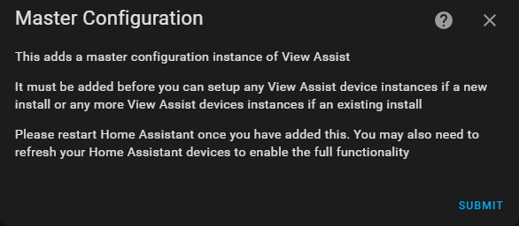

Welcome to the long awaited, much anticipated View Assist integration beta!  

A HUGE thank you goes out to Mark Parker @msp1974 for his MASSIVE help with making this a reality.  Mark has written the majority of the integration with my guidance.  You should check out his [Home Assistant Integration Examples](https://github.com/msp1974/HAIntegrationExamples) Github if you are intestered in creating your own integration.  His work has propelled View Assist to first class in very short order.  We would not be where we are today without his continued efforts and the hours and hours he has put in to make View Assist better!  Thanks again Mark!


# Installing the View Assist Integration

[](https://www.youtube.com/watch?v=cYqGGknf4C8)


Watch Video: https://www.youtube.com/watch?v=cYqGGknf4C8


## HACS
* Install HACS if you have not already
* Search for 'View Assist' in HACS
* Click "Add" to confirm, and then click "Download" to download and install the integration
* Restart Home Assistant
* Search for "View Assist" in HACS and install then restart
* In Home Assistant go to Settings -> Devices and Services -> Add integration -> Search for View Assist and add
* Configure the device(s)

## Manual Install

This integration can be installed by downloading the [view_assist](https://github.com/dinki/view_assist_integration/tree/main/custom_components) directory into your Home Assistant /config/custom_components directory and then restart Home Assistant.


## YAML Dashboards

We provide a javascript resource as part of this integration which is normally installed automatically.  However, if your main dashboard is in YAML mode (ie you define your dashboard in yaml files in your config directory), you will need to add the below to your resources.  This does not apply to most installations and you will know if you have this type of setup

```
url: /view_assist/js/view_assist.js
type: module
```

## Master Configuration

For new users, when adding the View Assist integration, it will force the adding of this master config instance. Subsequent adds will bring up the type selection and follow the previous config flow.

Once the View Assist integration is installed you will receive a notice that the 'Master Configuration' has been created.  Hit 'Submit' to proceed.




Finally, browse to the View Assist dashboard located in the left sidebar menu on the display device if setting up a View Assist satellite with display that you want to use View Assist to control.  You will see the browser id (va-xxxxxxxxx-xxxxxx format) for the unregistered device.  This value will be used in the device configuration step.  You do not need to record this number as it will be automatically provided as a choice.
